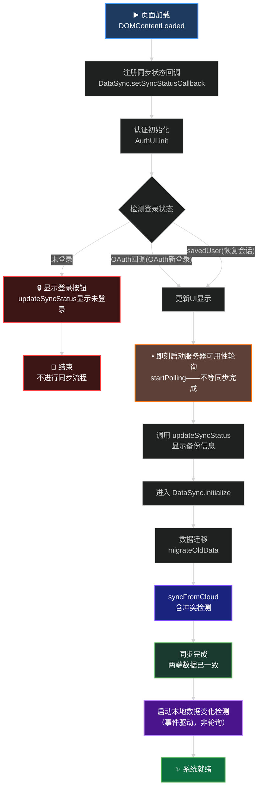
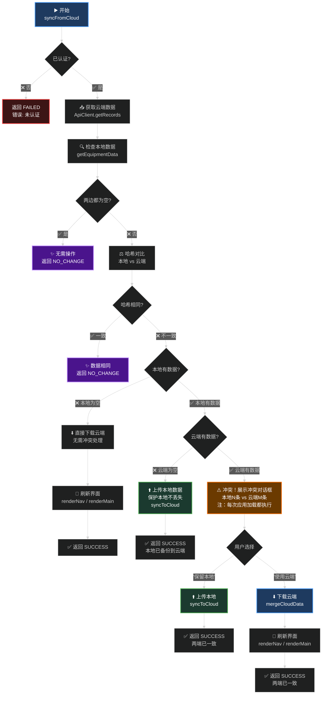
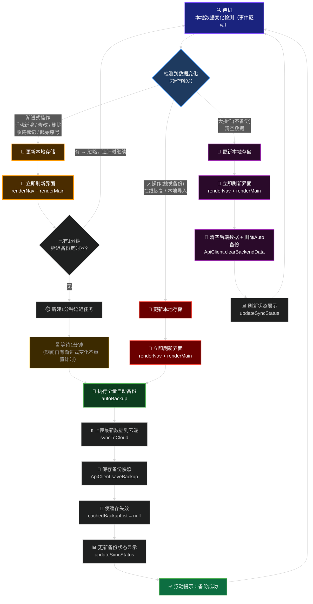
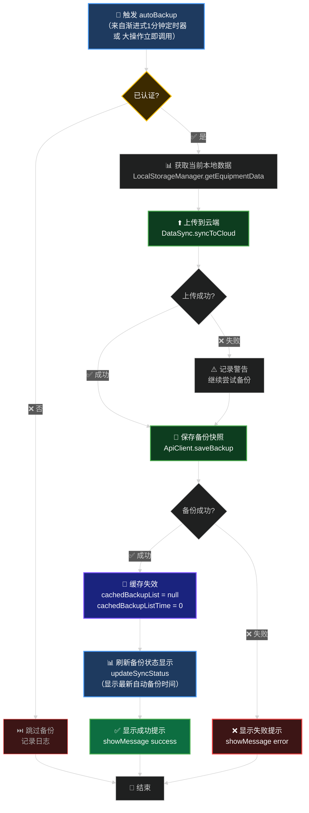

# 数据同步流程图 - 可视化参考

> ⚠️ **注意**: 本文件中的Mermaid图表在Markdown中显示可能不清晰。  
> **推荐使用**: 访问 [mermaid.live](https://mermaid.live) 在线查看和导出

## 📌 快速查看

### 方案1️⃣：使用在线工具 (最推荐)
1. 访问 https://mermaid.live (无需注册)
2. 在左侧编辑器中粘贴下方代码块 (英文部分)
3. 右侧实时显示图表，字体清晰

### 方案2️⃣：导出为PNG/SVG
```bash
# 安装mermaid-cli
npm install -g @mermaid-js/mermaid-cli

# 导出（从下方复制code块内容到 diagram.mmd）
mmdc -i diagram.mmd -o diagram.png -s 2
```

### 方案3️⃣：VS Code预览
- 安装插件: Markdown Preview Mermaid Support
- 打开此MD文件，按 `Ctrl+Shift+V` 预览
- 右键图表导出

---

## 📊 图表1：系统初始化流程



> **要点说明：**
> - 轮询（服务器可用性检测）在登录时立即启动，不等同步完成
> - `syncFromCloud` 完成后两端数据已一致，无需首次自动备份
> - 无论新登录还是恢复会话，均执行冲突检测
> - 系统就绪后采用**事件驱动**的数据变化检测，不依赖定时轮询

---

## 📊 图表2：syncFromCloud 决策树（修正版）



> **✔️ 决策顺序：先检本地 → 再检哈希 → 再检云端 → 再处理冲突**
> **✔️ 冲突检测无条件执行**：无对话标记展开适淳，冲突解决后两端哈希相同，下次自然进 noChange 分支不再弹框
> **✔️ 冲突解决 = 同步完成**：不需要额外的 autoBackup 步骤

---

## 📊 图表3：本地数据变化处理流程（统一视图）



> **操作分类说明：**
>
> | 操作类型 | 触发操作 | 备份时机 |
> |---------|---------|---------|
 | 渐进式 | 手动新增装备、修改装备、删除装备、收藏标记、起始序号调整 | 1分钟后（计时期间新操作不重置，到期统一备份） |
 | 大操作(备份) | 在线恢复备份、本地文件导入 | 立即备份 |
 | 大操作(不备份) | 清空数据 | 不做备份，清空后端数据+删除auto备份+刷新状态展示 |
>
> **关键原则：**
> - 本地存储更新 → **立即刷新界面** → 再进行后端操作（用户操作反馈不等网络）
> - 渐进式操作的定时器一旦建立**不会被后续操作重置**，1分钟到期后统一执行一次备份
> - 大操作直接旁路定时器，走立即备份路径

---

## 📊 图表4：全量自动备份（autoBackup）执行细节



> **autoBackup 被以下场景调用：**  
> - 渐进式操作（新增/修改/删除）：1分钟定时器到期后调用  
> - 大操作（在线恢复/本地导入/清空）：操作完成、界面刷新后立即调用  
>
> **缓存失效必须在 saveBackup 成功后执行**，确保 `updateSyncStatus` 拿到最新备份列表

---

## 📋 推荐使用方式

### 👍 最佳选择：在线查看
访问 [mermaid.live](https://mermaid.live) 并复制上方任一代码块，享受：
- ✅ 黑底白字，清晰易读
- ✅ 实时预览，即时反馈
- ✅ 一键导出PNG/SVG
- ✅ 无需安装任何工具

### 📦 导出本地图片
```bash
# 一次性安装
npm install -g @mermaid-js/mermaid-cli

# 导出此文件中的所有图表
mmdc -i FLOWCHART_DIAGRAMS.md -o ./diagrams/
```

### 🖥️ VS Code 内预览
1. 安装插件：**Markdown Preview Mermaid Support**
2. 打开此文件，按 `Ctrl+Shift+V` 预览
3. 右键图表导出为PNG

---

## 🎯 图表速查表

| # | 名称 | 重点关注 | 用途 |
|----|------|----------|------|
| 1️⃣ | 系统初始化流程 | 启动顺序、轮询、数据变化检测启动时机 | 了解应用如何启动 |
| 2️⃣ | syncFromCloud决策树 | 冲突检测和数据保护判断顺序 | 理解云端同步的完整逻辑 |
| 3️⃣ | 本地数据变化处理流程 | 渐进式vs大操作的备份触发策略 | 理解备份的触发机制 |
| 4️⃣ | autoBackup执行细节 | syncToCloud→saveBackup→缓存失效顺序 | 深入理解备份一致性保障 |

**建议阅读顺序**：图1 → 图2 → 图3 → 图4（从全景到细节）

---

## ⚠️ 关键数据流程注意点

1. **未登录时不进入同步流程**
   - `AuthUI.init()` 检测登录状态后，若未登录直接返回
   - 不调用 `DataSync.initialize()`，不访问后端

2. **冲突标记的正确生命周期**
   - ✅ **正确做法**：`syncFromCloud` 内部，两端哈希不同时弹冲突对话框；解决后两端哈希匹配，下次同步自然走 NO_CHANGE 分支，不再弹框
   - ❌ **不再需要** `conflictCheckFlag`：冲突解决后数据一致，本身就不会再冲突

3. **syncFromCloud 的判断顺序（重要）**
   - 先检查**两边是否都为空** → 是则直接结束
   - 再做**哈希对比** → 相同则直接结束
   - 哈希不同时，检查**本地是否有数据** → 为空则直接下载云端
   - 本地有数据时，检查**云端是否有数据**
     - 云端无数据 → 上传本地（保护本地不丢失）
     - 云端有数据 → 弹冲突对话框

4. **数据变化事件驱动（替代轮询）**
   - ✅ **渐进式操作**（新增/修改/删除/收藏标记/起始序号）：本地变更 → 刷新界面 → 1分钟延迟备份（计时期间再有同类操作**不重置计时**，到期统一备份）
   - ✅ **大操作-触发备份**（在线恢复/本地导入）：本地变更 → 刷新界面 → 立即备份
   - ✅ **大操作-不备份**（清空数据）：清空本地 → 刷新界面 → 清空后端数据 → 刷新状态展示
   - ❌ **不再使用** 5分钟轮询检测 和 10分钟定时备份任务

5. **本地操作优先，网络操作靠后**
   - 数据变化后**先更新本地存储**，**再立即刷新界面**，最后才做后端上传/备份
   - 用户看到界面变化不需要等待网络完成

6. **autoBackup 执行时序**
   - ✅ 先 `syncToCloud` 将最新数据上传
   - ✅ 再 `saveBackup` 创建备份快照
   - ✅ 成功后 `cachedBackupList = null` 使缓存失效
   - ✅ 最后 `updateSyncStatus` 刷新显示
   - ❌ **不能在 syncToCloud 前就 saveBackup**（否则备份的是旧数据）

7. **浮动提示机制**
   - 所有数据操作（备份/还原/清空/同步）完成后显示浮动提示
   - 位置：左下角，5秒自动消失
   - 格式：统一的 success / error / warning 颜色分类

---

## 🔗 相关文档

- [ARCHITECTURE.md](../ARCHITECTURE.md) - 系统整体架构
- [code_requirements.md](code_requirements.md) - 代码规范和标准

---

**最后更新**: 2026年2月26日
**版本**: 前端1.2.0 / 后端1.2.0
**样式**: ✨ 中文黑底白字，高对比度易阅读
