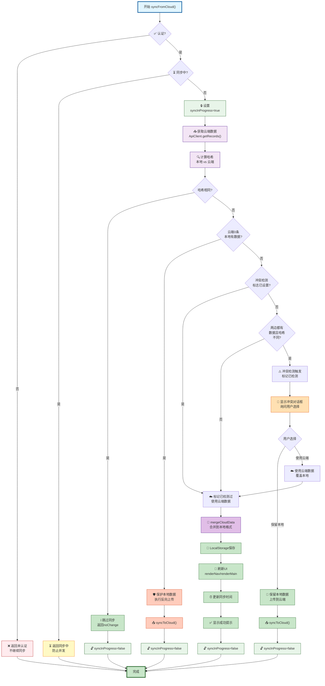
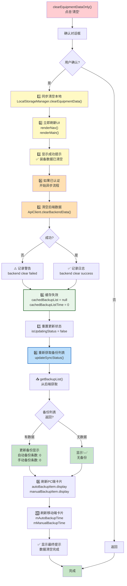

# 数据同步流程图 - 可视化文件

本文件包含所有Mermaid流程图的源代码，可用于导出为PNG/SVG图片。

## 📌 快速导出步骤

1. **在线导出** (推荐)：
   - 访问 [mermaid.live](https://mermaid.live)
   - 复制下方任一"Mermaid代码块"到编辑器
   - 点击"Download"导出为PNG或SVG

2. **本地导出**：
   ```bash
   # 安装mermaid-cli
   npm install -g @mermaid-js/mermaid-cli
   
   # 导出单个图表
   mmdc -i diagram.mmd -o diagram.png
   ```

3. **VS Code导出**：
   - 安装 [Markdown Preview Mermaid Support](https://marketplace.visualstudio.com/items?itemName=bierner.markdown-mermaid)
   - 右键选择"Export Diagram as SVG/PNG"

---

## 📊 图表1：整体系统初始化与触发流程

```mermaid
graph TD
    A["🚀 页面加载<br/>DOMContentLoaded"] --> B["initializeApp()"]
    
    B --> C["AuthUI.init()<br/>检查登录状态"]
    C --> D{已登录?}
    
    D -->|是| E["DataSync.initialize()"]
    D -->|否| E
    
    E --> F["OAuth 回调处理"]
    F --> G{新登录?}
    
    G -->|是| G1["清除冲突检测标志"]
    G1 --> G2["syncFromCloud()"]
    G -->|否| E1["enableAutoSync()"]
    G2 --> E1
    
    E1 --> H["首次自动备份<br/>autoBackup()"]
    H --> I["设置定时器<br/>每10分钟备份"]
    I --> J["页面卸载事件<br/>beforeunload自动备份"]
    
    J --> J1["正式运行系统"]
    
    style A fill:#e1f5ff
    style J1 fill:#c8e6c9
    
    subgraph SYNC["▼ 同步流程"]
        direction LR
        S1["syncFromCloud()"] --> S2{"认证?"}
        S2 -->|否| S3["返回失败"]
        S2 -->|是| S4["获取云端数据<br/>ApiClient.getRecords()"]
        S4 --> S5{"同步中?"}
        S5 -->|是| S6["返回等待"]
        S5 -->|否| S7["标记syncInProgress=true"]
        S7 --> S8["对比本地/云端哈希"]
        S8 --> S9{数据相同?}
        S9 -->|是| S10["跳过同步<br/>返回noChange"]
        S9 -->|否| S11{云端0条<br/>本地多条?}
        S11 -->|是| S12["反向上传<br/>syncToCloud()"]
        S11 -->|否| S13{冲突检测标志?}
        S13 -->|已检查| S14["使用云端覆盖"]
        S13 -->|未检查| S15{两边都<br/>有数据且<br/>不同?}
        S15 -->|是| S16["标记已检查"]
        S16 --> S17["显示冲突对话框"]
        S17 --> S18{用户选择?}
        S18 -->|保留本地| S19["上传本地<br/>syncToCloud()"]
        S18 -->|使用云端| S20["继续"]
        S19 --> S20
        S15 -->|否| S14
        S14 --> S21["mergeCloudData<br/>合并到本地"]
        S21 --> S22["LocalStorage保存"]
        S22 --> S23["刷新UI<br/>renderNav/renderMain"]
        S23 --> S24["更新同步时间"]
        S24 --> S25["显示成功提示"]
        S25 --> S26["syncInProgress=false"]
        
        style S1 fill:#fff3e0
        style S12 fill:#f3e5f5
        style S17 fill:#ffebee
        style S26 fill:#c8e6c9
    end
    
    subgraph UPLOAD["▼ 上传流程"]
        direction LR
        U1["syncToCloud()"] --> U2{"认证?"}
        U2 -->|否| U3["返回失败"]
        U2 -->|是| U4["获取本地数据"]
        U4 --> U5{"同步中?"}
        U5 -->|是| U6["返回等待"]
        U5 -->|否| U7["标记syncInProgress=true"]
        U7 --> U8["对比本地/云端哈希"]
        U8 --> U9{数据相同?}
        U9 -->|是| U10["跳过上传<br/>返回noChange"]
        U9 -->|否| U11["调用Api.importData<br/>上传所有数据"]
        U11 --> U12{成功?}
        U12 -->|是| U13["更新同步时间"]
        U13 --> U14["显示成功提示"]
        U12 -->|否| U15{离线?}
        U15 -->|是| U16["显示离线提示<br/>返回offline"]
        U15 -->|否| U17["显示错误提示<br/>返回error"]
        U14 --> U18["syncInProgress=false"]
        U16 --> U18
        U17 --> U18
        
        style U1 fill:#fff3e0
        style U18 fill:#c8e6c9
    end
    
    subgraph BACKUP["▼ 备份与恢复"]
        direction LR
        B1["saveManualBackup()"] --> B2{"认证?"}
        B2 -->|否| B3["显示错误"]
        B2 -->|是| B4["检查本地数据"]
        B4 --> B5{有数据?}
        B5 -->|是| B6["syncToCloud()<br/>先同步"]
        B5 -->|否| B7["直接保存"]
        B6 --> B7
        B7 --> B8["Api.saveBackup<br/>保存backup"]
        B8 --> B9["刷新备份状态"]
        
        B10["restoreManualBackup()"] --> B11["获取备份列表<br/>有缓存机制"]
        B11 --> B12["查找手动备份"]
        B12 --> B13{找到?}
        B13 -->|否| B14["显示无可用备份"]
        B13 -->|是| B15["用户确认对话框"]
        B15 --> B16{确认?}
        B16 -->|否| B17["返回取消"]
        B16 -->|是| B18["Api.restoreBackup()"]
        B18 --> B19["showSyncProgress"]
        B19 --> B20["Api.getRecords()<br/>拉取最新数据"]
        B20 --> B21["mergeCloudData"]
        B21 --> B22["保存本地"]
        B22 --> B23["刷新UI"]
        B23 --> B24["autoBackup()<br/>立即备份"]
        B24 --> B25["刷新备份面板"]
        
        style B1 fill:#fff3e0
        style B10 fill:#fff3e0
        style B24 fill:#f3e5f5
    end
    
    subgraph ACTION["▼ 用户操作触发"]
        direction LR
        AC1["点击'同步云端'<br/>syncFromCloud()"] 
        AC2["点击'上传到云端'<br/>syncToCloud()"]
        AC3["点击'在线保存'<br/>saveManualBackup"]
        AC4["点击'在线恢复'<br/>restoreManualBackup"]
        AC5["点击'清空数据'<br/>clearAllData"]
        AC6["页面卸载<br/>beforeunload"]
        
        AC6 --> AC7["navigator.sendBeacon<br/>自动备份"]
        
        style AC1 fill:#e3f2fd
        style AC2 fill:#e3f2fd
        style AC3 fill:#fce4ec
        style AC4 fill:#fce4ec
        style AC5 fill:#ffebee
        style AC7 fill:#fff9c4
    end
    
    subgraph TIMER["▼ 定时触发"]
        direction LR
        T1["应用启动"]
        T2["每10分钟检查<br/>startPolling"]
        T2 --> T3["updateSyncStatus<br/>检查备份"]
        T1 --> TA["首次自动备份<br/>autoBackup()"]
        T1 --> TB["每10分钟自动备份"]
        TB --> TC["autoBackup()"]
        
        style TB fill:#fff9c4
        style TA fill:#fff9c4
        style TC fill:#fff9c4
    end
    
    SYNC --> SYNC_OUT["更新状态显示"]
    UPLOAD --> UPLOAD_OUT["提示用户"]
    BACKUP --> BACKUP_OUT["结果交互"]
    ACTION --> ACTION_OUT["执行对应流程"]
    TIMER --> TIMER_OUT["定时检查/备份"]
    
    style SYNC fill:#f5f5f5
    style UPLOAD fill:#f5f5f5
    style BACKUP fill:#f5f5f5
    style ACTION fill:#f5f5f5
    style TIMER fill:#f5f5f5
```



---

## 📊 图表2：syncFromCloud() 详细决策树



---

## 📊 图表3：备份/恢复/清空详细流程

```mermaid
graph LR
    subgraph MANUAL["📚 手动备份 saveManualBackup()"]
        direction TB
        M1["⏱️ 开始"] --> M2{"✅ 认证?"}
        M2 -->|否| M_ERR["❌ 显示错误<br/>返回"]
        M2 -->|是| M3["📊 获取本地数据"]
        M3 --> M4{数据为空<br/>或为0?}
        M4 -->|是| M5["⚠️ 检查是否<br/>有装备数据"]
        M5 --> M_SAVE
        M4 -->|否| M6["🔐 防护:<br/>本地有数据"]
        M6 --> M7["📤 先调用<br/>syncToCloud<br/>上传到云端"]
        M7 --> M8{上传<br/>成功?}
        M8 -->|失败| M_ERR
        M8 -->|成功| M_SAVE["💾 调用保存备份<br/>ApiClient.saveBackup"]
        M_SAVE --> M9{"✅ 备份<br/>成功?"}
        M9 -->|是| M10["✅ 显示成功<br/>记录条数"]
        M10 --> M11["🔄 刷新备份显示<br/>updateSyncStatus"]
        M11 --> M_END["✨ 返回result"]
        M9 -->|否| M12["❌ 显示失败<br/>返回error"]
        M12 --> M_END
        M_ERR --> M_END
    end
    
    subgraph RESTORE["♻️ 手动恢复 restoreManualBackup()"]
        direction TB
        R1["⏱️ 开始"] --> R2["📋 获取备份列表<br/>有缓存:5分钟"]
        R2 --> R3{列表<br/>有效且<br/>有备份?}
        R3 -->|否| R_FAIL["⚠️ 无可用备份<br/>返回"]
        R3 -->|是| R4["🔍 查找最新<br/>手动备份"]
        R4 --> R5{找到?}
        R5 -->|否| R_FAIL
        R5 -->|是| R6["📢 显示确认<br/>对话框<br/>时间/条数"]
        R6 --> R7{用户<br/>确认?}
        R7 -->|取消| R_CANCEL["❌ 返回取消"]
        R7 -->|确认| R8["🔄 调用恢复<br/>ApiClient.restoreBackup"]
        R8 --> R9{恢复<br/>成功?}
        R9 -->|失败| R10["❌ 显示失败<br/>返回"]
        R9 -->|成功| R11["🔓 后端已恢复<br/>开始拉取数据"]
        R11 --> R12["⏳ 显示加载中"]
        R12 --> R13["📥 获取所有数据<br/>ApiClient.getRecords"]
        R13 --> R14{获取<br/>成功?}
        R14 -->|失败| R15["⚠️ 后端已恢复<br/>但拉取失败<br/>请手动刷新"]
        R14 -->|成功| R16["🔀 合并数据<br/>mergeCloudData"]
        R16 --> R17["💾 保存本地<br/>LocalStorage"]
        R17 --> R18["🔄 刷新UI<br/>renderNav/renderMain"]
        R18 --> R19["⏰ 刷新备份面板<br/>updateSyncStatus"]
        R19 --> R20["🎯 关键步骤:<br/>自动备份<br/>autoBackup()"]
        R20 --> R21{备份<br/>成功?}
        R21 -->|是| R22["✅ 显示成功<br/>恢复完成"]
        R21 -->|否| R23["⚠️ 恢复了数据<br/>但备份失败"]
        R22 --> R_END["✨ 返回"]
        R23 --> R_END
        R15 --> R_END
        R10 --> R_END
        R_FAIL --> R_END
        R_CANCEL --> R_END
    end
    
    subgraph CLEAR["🗑️ 清空数据 clearAllData()"]
        direction TB
        C1["⏱️ 开始"] --> C2["📢 显示确认<br/>对话框<br/>\"确实要清空?\"]
        C2 --> C3{用户<br/>确认?}
        C3 -->|取消| C_CANCEL["❌ 返回"]
        C3 -->|确认| C4["🔓 开始清空"]
        C4 --> C5["💾 清空本地<br/>LocalStorageManager"]
        C5 --> C6["✅ 本地清空完成<br/>console.log记录"]
        C6 --> C7{"✅ 认证<br/>状态?"}
        C7 -->|否| C8["ℹ️ 无需清空后端<br/>返回成功"]
        C7 -->|是| C9["🌐 调用后端清空<br/>ApiClient.clearBackendData"]
        C9 --> C10{清空<br/>成功?}
        C10 -->|失败| C11["⚠️ 后端清空失败<br/>console.warn记录<br/>但继续"]
        C10 -->|成功| C12["✅ 后端清空完成"]
        C11 --> C_END["✨ 返回成功<br/>数据已清空"]
        C12 --> C_END
        C8 --> C_END
        C_CANCEL --> C_END
        
        subgraph WARNING["⚠️ 清空机制说明"]
            W1["本地清空:同步"]
            W2["后端清空:异步"]
            W3["页面刷新时不会<br/>从后端还原"]
            W1 --> W2 --> W3
        end
    end
    
    subgraph EVENT["🔔 触发事件"]
        direction TB
        E1["页面启动"] --> E1A["首次自动<br/>autoBackup"]
        E1B["用户手动<br/>同步"] --> E1C["syncFromCloud"]
        E1D["用户手动<br/>上传"] --> E1E["syncToCloud"]
        E1F["10分钟定时"] --> E1G["autoBackup<br/>备份数据"]
        E1H["页面卸载"] --> E1I["navigator.sendBeacon<br/>发送备份请求"]
    end
    
    MANUAL --> SYNC["更新 updateSyncStatus()"]
    RESTORE --> SYNC
    SYNC --> UI["刷新PC和移动端<br/>备份信息显示"]
    
    CLEAR --> LOCAL["本地数据清空<br/>UI立即刷新"]
    CLEAR --> BACK["后端数据清空<br/>异步进行"]
    
    style MANUAL fill:#ffe0b2,stroke:#e65100,stroke-width:2px
    style RESTORE fill:#c5cae9,stroke:#283593,stroke-width:2px
    style CLEAR fill:#ffccbc,stroke:#d84315,stroke-width:2px
    style EVENT fill:#e1f5fe,stroke:#01579b,stroke-width:2px
    style WARNING fill:#fff9c4,stroke:#f57f17,stroke-width:2px
```

---

## 📊 图表4：清空数据后缓存失效和刷新点



---

## 📋 如何使用这些图表

### 1. 在线查看
- 访问 [mermaid.live](https://mermaid.live)
- 选择一个上面的Mermaid代码块
- 复制整个代码（从 ``` 到 ```）
- 粘贴到编辑器左侧

### 2. 导出为PNG
- 编辑器右上角点击"⋯" → "Export"
- 选择 "PNG" 或 "SVG"

### 3. 在Markdown中使用
- 这些代码块可以直接粘贴到任何支持Mermaid的Markdown编辑器
- VS Code, GitHub, Notion, Obsidian 都支持

### 4. 命令行导出
```bash
# 快速安装mermaid工具
npm install -g @mermaid-js/mermaid-cli

# 从markdown文件导出
mmdc -i FLOWCHART_DIAGRAMS.md -o flowcharts/

# 或从纯mermaid文件导出
echo "graph TD
  A --> B
" > diagram.mmd
mmdc -i diagram.mmd -o diagram.png
```

---

## 🎯 各图表说明

| 图表 | 用途 | 重点 |
|-----|-----|-----|
| 图表1 | 系统全景 | 5个流程模块+4个触发事件 |
| 图表2 | 同步详解 | 冲突检测+数据保护逻辑 |
| 图表3 | 备份操作 | 手动/自动备份+清空流程 |
| 图表4 | 清空刷新 | 缓存失效机制 |

**推荐按照顺序查看**，从全景→细节，逐步理解整个系统。

---

## 🔗 相关文档

- [sync_flowchart_guide.md](sync_flowchart_guide.md) - 详细文字说明和代码参考
- [ARCHITECTURE.md](ARCHITECTURE.md) - 系统架构说明
- [code_requirements.md](code_requirements.md) - 代码规范

---

**最后更新**: 2026年2月26日 (commit bcc4980)

**版本**: 前端1.2.0 / 后端1.2.0
