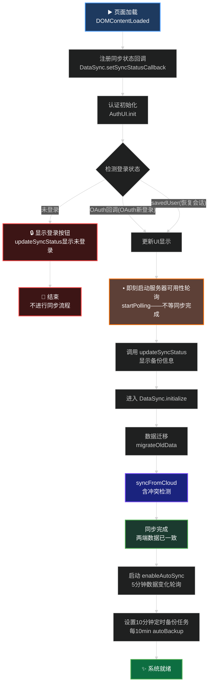
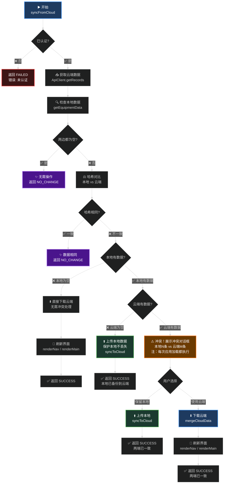
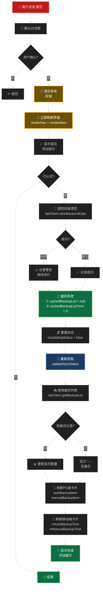

# 数据同步流程图 - 可视化参考

> ⚠️ **注意**: 本文件中的Mermaid图表在Markdown中显示可能不清晰。  
> **推荐使用**: 访问 [mermaid.live](https://mermaid.live) 在线查看和导出

## 📌 快速查看

### 方案1️⃣：使用在线工具 (最推荐)
1. 访问 https://mermaid.live (无需注册)
2. 在左侧编辑器中粘贴下方代码块 (英文部分)
3. 右侧实时显示图表，字体清晰

### 方案2️⃣：导出为PNG/SVG
```bash
# 安装mermaid-cli
npm install -g @mermaid-js/mermaid-cli

# 导出（从下方复制code块内容到 diagram.mmd）
mmdc -i diagram.mmd -o diagram.png -s 2
```

### 方案3️⃣：VS Code预览
- 安装插件: Markdown Preview Mermaid Support
- 打开此MD文件，按 `Ctrl+Shift+V` 预览
- 右键图表导出

---

## 📊 图表1：系统初始化流程



> **要点说明：**
> - 轮询（服务器可用性检测）在登录时立即启动，不等同步完成
> - `syncFromCloud` 完成后两端数据已一致，无需首次自动备份
> - 无论新登录还是恢复会话，均执行冲突检测

---

## 📊 图表2：syncFromCloud 决策树（修正版）



> **✔️ 决策顺序：先检本地 → 再检哈希 → 再检云端 → 再处理冲突**
> **✔️ 冲突检测无条件执行**：无对话标记展开适淳，冲突解决后两端哈希相同，下次自然进 noChange 分支不再弹框
> **✔️ 冲突解决 = 同步完成**：不需要额外的 autoBackup 步骤

---

## 📊 图表3：备份/恢复/清空流程

```mermaid
%%{init: {'theme':'dark'}}%%
graph TD
    subgraph BACKUP["💾 手动备份 saveManualBackup"]
        B1["▶️ 开始"] --> B2{已认证?}
        B2 -->|否| B3["❌ 显示错误"]
        B2 -->|是| B4["📊 获取本地数据"]
        B4 --> B5{有数据?}
        B5 -->|是| B6["📤 先同步到云端<br/>syncToCloud"]
        B5 -->|否| B7["继续执行"]
        B6 --> B7
        B7 --> B8["💾 保存备份<br/>ApiClient.saveBackup"]
        B8 --> B9{成功?}
        B9 -->|是| B10["📊 更新显示"]
        B9 -->|否| B11["❌ 显示错误"]
        B10 --> B12["✨ 完成"]
        B11 --> B12
        B3 --> B12
    end
    
    subgraph RESTORE["♻️ 手动恢复 restoreManualBackup"]
        R1["▶️ 开始"] --> R2["📋 获取备份列表<br/>5分钟缓存"]
        R2 --> R3{列表有效<br/>有备份?}
        R3 -->|否| R4["⚠️ 显示无备份"]
        R3 -->|是| R5["🔍 查找手动备份"]
        R5 --> R6{找到?}
        R6 -->|否| R4
        R6 -->|是| R7["💬 显示确认<br/>对话框"]
        R7 --> R8{用户确认?}
        R8 -->|否| R9["❌ 取消"]
        R8 -->|是| R10["🔄 恢复备份<br/>ApiClient.restoreBackup"]
        R10 --> R11["⏳ 显示加载中"]
        R11 --> R12["📥 获取最新数据<br/>ApiClient.getRecords"]
        R12 --> R13{成功?}
        R13 -->|否| R14["❌ 显示错误"]
        R13 -->|是| R15["🔀 合并数据<br/>mergeCloudData"]
        R15 --> R16["💾 保存本地"]
        R16 --> R17["🎨 刷新界面"]
        R17 --> R18["🚀 执行自动备份<br/>autoBackup"]
        R18 --> R19["📊 更新显示<br/>⚠️ 关键:先验证数据再备份"]
        R19 --> R20["✨ 完成"]
        R14 --> R20
        R9 --> R20
        R4 --> R20
    end
    
    subgraph CLEAR["🗑️ 清空数据 clearAllData"]
        C1["▶️ 开始"] --> C2["💬 确认对话框"]
        C2 --> C3{用户确认?}
        C3 -->|否| C4["❌ 取消"]
        C3 -->|是| C5["🔄 清空本地<br/>LocalStorage"]
        C5 --> C6["🎨 立即刷新界面"]
        C6 --> C7{已认证?}
        C7 -->|否| C8["✨ 完成"]
        C7 -->|是| C9["📡 清空后端数据<br/>ApiClient.clearBackendData"]
        C9 --> C10{成功?}
        C10 -->|是| C11["✅ 记录成功"]
        C10 -->|否| C12["⚠️ 记录警告<br/>继续"]
        C11 --> C13["🔄 缓存失效<br/>cachedBackupList = null<br/>cachedBackupListTime = 0"]
        C12 --> C13
        C13 --> C14["🔄 重新更新状态<br/>updateSyncStatus"]
        C14 --> C8
        C4 --> C8
    end
    
    BACKUP --> AFTER["→ 更新备份状态<br/>updateSyncStatus"]
    RESTORE --> AFTER
    CLEAR --> AFTER
    
    style BACKUP fill:#5d4037,stroke:#ff6f00,stroke-width:2px,color:#fff
    style RESTORE fill:#1a237e,stroke:#7c4dff,stroke-width:2px,color:#fff
    style CLEAR fill:#b71c1c,stroke:#ff5252,stroke-width:2px,color:#fff
    style AFTER fill:#0d6e41,stroke:#4caf50,stroke-width:2px,color:#fff
```



---

## 📊 图表4：缓存失效与UI刷新机制



---

## 📋 推荐使用方式

### 👍 最佳选择：在线查看
访问 [mermaid.live](https://mermaid.live) 并复制上方任一代码块，享受：
- ✅ 黑底白字，清晰易读
- ✅ 实时预览，即时反馈
- ✅ 一键导出PNG/SVG
- ✅ 无需安装任何工具

### 📦 导出本地图片
```bash
# 一次性安装
npm install -g @mermaid-js/mermaid-cli

# 导出此文件中的所有图表
mmdc -i FLOWCHART_DIAGRAMS.md -o ./diagrams/
```

### 🖥️ VS Code 内预览
1. 安装插件：**Markdown Preview Mermaid Support**
2. 打开此文件，按 `Ctrl+Shift+V` 预览
3. 右键图表导出为PNG

---

## 🎯 图表速查表

| # | 名称 | 重点关注 | 用途 |
|----|------|----------|------|
| 1️⃣ | 系统初始化流程 | 启动顺序和定时器 | 了解应用如何启动及备份策略 |
| 2️⃣ | syncFromCloud决策树 | 冲突检测和数据保护 | 理解云端同步的完整逻辑 |
| 3️⃣ | 备份/恢复/清空流程 | 操作顺序和缓存处理 | 追踪数据相关操作的完整链路 |
| 4️⃣ | 缓存失效与UI刷新 | 缓存清理时机 | 深入理解数据一致性的保障 |

**建议阅读顺序**：图1 → 图2 → 图3 → 图4（从全景到细节）

---

## ⚠️ 关键数据流程注意点

1. **未登录时不进入同步流程**
   - `AuthUI.init()` 检测登录状态后，若未登录直接返回
   - 不调用 `DataSync.initialize()`，不访问后端

2. **冲突标记的正确生命周期**
   - ❌ **错误做法**：在初始化时或同步前清除冲突标志（会导致每次页面刷新都弹冲突框）
   - ✅ **正确做法**：冲突标志只在 `syncFromCloud` 内，冲突解决完成 **之后** 才设置（`setConflictCheckFlag`）
   - 一旦设置，本会话内不再弹冲突框；新登录会话则重新触发

3. **syncFromCloud 的判断顺序（重要）**
   - 先检查**本地是否有数据**，为空则直接下载云端
   - 本地有数据时，再检查**云端是否有数据**
     - 云端无数据 → 上传本地（保护本地不丢失）
     - 云端有数据 → 哈希比对 → 相同则结束，不同则冲突解决

4. **还原数据时的时序**
   - ✅ 先 `restoreBackup` API 恢复后端
   - ✅ 再 `getRecords` 获取最新数据并合并
   - ✅ 最后 `autoBackup` 执行自动备份
   - ❌ **不能在merge前就执行backup**（否则备份的是0条数据）

5. **缓存失效必须点**
   - 清空/备份/还原完成后：`cachedBackupList = null` + `cachedBackupListTime = 0`
   - UI刷新前必须执行缓存失效，确保显示最新备份状态

6. **浮动提示机制**
   - 所有数据操作（备份/还原/清空/同步）完成后显示浮动提示
   - 位置：左下角，5秒自动消失
   - 格式：统一的 success / error / warning 颜色分类

---

## 🔗 相关文档

- [sync_flowchart_guide.md](sync_flowchart_guide.md) - 详细文字说明和代码位置
- [ARCHITECTURE.md](../ARCHITECTURE.md) - 系统整体架构
- [code_requirements.md](code_requirements.md) - 代码规范和标准

---

**最后更新**: 2026年2月26日  
**版本**: 前端1.2.0 / 后端1.2.0  
**样式**: ✨ 中文黑底白字，高对比度易阅读
