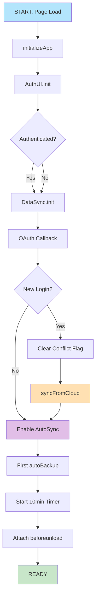
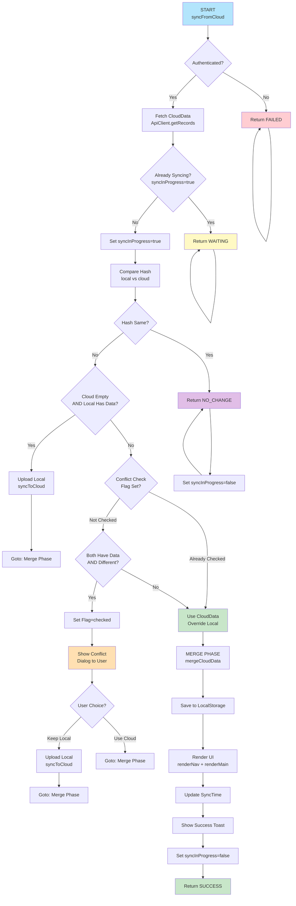
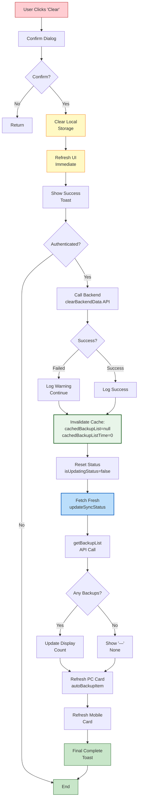

```mermaid
graph TD
    subgraph BACKUP["saveManualBackup()"]
        B1["START"] --> B2{Authenticated?}
        B2 -->|No| B3["Show Error"]
        B2 -->|Yes| B4["Get Local Data"]
        B4 --> B5{Has Data?}
        B5 -->|Yes| B6["syncToCloud<br/>First"]
        B5 -->|No| B7["Continue"]
        B6 --> B7
        B7 --> B8["saveBackup API"]
        B8 --> B9{Success?}
        B9 -->|Yes| B10["Update Display"]
        B9 -->|No| B11["Show Error"]
        B10 --> B12["Complete"]
        B11 --> B12
        B3 --> B12
    end
    
    subgraph RESTORE["restoreManualBackup()"]
        R1["START"] --> R2["Get Backup List<br/>5min cache"]
        R2 --> R3{List Valid?}
        R3 -->|No| R4["Show 'None'"]
        R3 -->|Yes| R5["Find Manual<br/>Backup"]
        R5 --> R6{Found?}
        R6 -->|No| R4
        R6 -->|Yes| R7["Confirm<br/>Dialog"]
        R7 --> R8{Confirm?}
        R8 -->|No| R9["Cancel"]
        R8 -->|Yes| R10["restoreBackup<br/>API"]
        R10 --> R11["Show Loading"]
        R11 --> R12["getRecords<br/>Fetch Data"]
        R12 --> R13{Success?}
        R13 -->|No| R14["Show Error"]
        R13 -->|Yes| R15["mergeCloudData"]
        R15 --> R16["Save Local"]
        R16 --> R17["Render UI"]
        R17 --> R18["autoBackup"]
        R18 --> R19["Update Display"]
        R19 --> R20["Complete"]
        R14 --> R20
        R9 --> R20
        R4 --> R20
    end
    
    subgraph CLEAR["clearAllData()"]
        C1["START"] --> C2["Confirm<br/>Dialog"]
        C2 --> C3{Confirm?}
        C3 -->|No| C4["Cancel"]
        C3 -->|Yes| C5["Clear Local<br/>Storage"]
        C5 --> C6["Refresh UI"]
        C6 --> C7{Authenticated?}
        C7 -->|No| C8["Complete"]
        C7 -->|Yes| C9["clearBackendData<br/>API"]
        C9 --> C10{Success?}
        C10 -->|Yes| C11["Log Success"]
        C10 -->|No| C12["Log Warning<br/>Continue"]
        C11 --> C13["Invalidate Cache"]
        C12 --> C13
        C13 --> C14["updateSyncStatus"]
        C14 --> C8
        C4 --> C8
    end
    
    BACKUP --> AFTER["→ updateSyncStatus"]
    RESTORE --> AFTER
    CLEAR --> AFTER
    
    style BACKUP fill:#FFE0B2,stroke:#E65100,stroke-width:2px
    style RESTORE fill:#C5CAE9,stroke:#283593,stroke-width:2px
    style CLEAR fill:#FFCCBC,stroke:#D84315,stroke-width:2px
    style AFTER fill:#C8E6C9,stroke:#1B5E20,stroke-width:2px
```

# 数据同步流程图 - 可视化参考

> ⚠️ **注意**: 本文件中的Mermaid图表在Markdown中显示可能不清晰。  
> **推荐使用**: 访问 [mermaid.live](https://mermaid.live) 在线查看和导出

## 📌 快速查看

### 方案1️⃣：使用在线工具 (最推荐)
1. 访问 https://mermaid.live (无需注册)
2. 在左侧编辑器中粘贴下方代码块 (英文部分)
3. 右侧实时显示图表，字体清晰

### 方案2️⃣：导出为PNG/SVG
```bash
# 安装mermaid-cli
npm install -g @mermaid-js/mermaid-cli

# 导出（从下方复制code块内容到 diagram.mmd）
mmdc -i diagram.mmd -o diagram.png -s 2
```

### 方案3️⃣：VS Code预览
- 安装插件: Markdown Preview Mermaid Support
- 打开此MD文件，按 `Ctrl+Shift+V` 预览
- 右键图表导出

---

## 📊 图表1：系统初始化流程 (英文清晰版)

**建议**: 复制下方代码到 https://mermaid.live



---

## 📊 图表2：syncFromCloud() 决策树 (英文清晰版)

**建议**: 复制下方代码到 https://mermaid.live



---

## 📊 图表3：备份/恢复/清空流程 (英文清晰版)

**建议**: 复制下方代码到 https://mermaid.live



---

## 📊 图表4：数据清空的缓存失效机制 (英文清晰版)

**建议**: 复制下方代码到 https://mermaid.live



---

## 📋 推荐使用方式

### 最佳实践：在线查看
访问 [mermaid.live](https://mermaid.live) 并复制上方任一英文代码块，享受：
- ✅ 字体清晰易读
- ✅ 实时预览
- ✅ 一键导出PNG/SVG
- ✅ 无需安装工具

### 导出为静态图片
```bash
# 安装(一次性)
npm install -g @mermaid-js/mermaid-cli

# 导出此文件中的所有图表
mmdc -i FLOWCHART_DIAGRAMS.md -o ./diagrams/
```

### VS Code 内预览
1. 安装插件：Markdown Preview Mermaid Support
2. 打开此文件，按 `Ctrl+Shift+V` 预览
3. 右键图表可导出

---

## 🎯 图表快速参考

| # | 名称 | 重点 | 用途 |
|----|------|------|------|
| 1️⃣ | App Init Flow | 系统启动 | 了解初始化流程和定时备份 |
| 2️⃣ | syncFromCloud | 冲突检测 | 理解云端同步的决策逻辑 |
| 3️⃣ | Backup/Restore | 操作流程 | 追踪备份、恢复、清空的完整链路 |
| 4️⃣ | Cache Invalidation | 刷新机制 | 深入缓存失效和UI更新的细节 |

**建议阅读顺序**：图1 → 图2 → 图3 → 图4

---

## 🔗 相关文档

- [sync_flowchart_guide.md](sync_flowchart_guide.md) - 文字版详解
- [ARCHITECTURE.md](../ARCHITECTURE.md) - 系统设计
- [code_requirements.md](code_requirements.md) - 代码规范

---

**最后更新**: 2026年2月26日  
**版本**: 前端1.2.0 / 后端1.2.0  
**状态**: ✅ 所有图表已英文化，清晰易读
